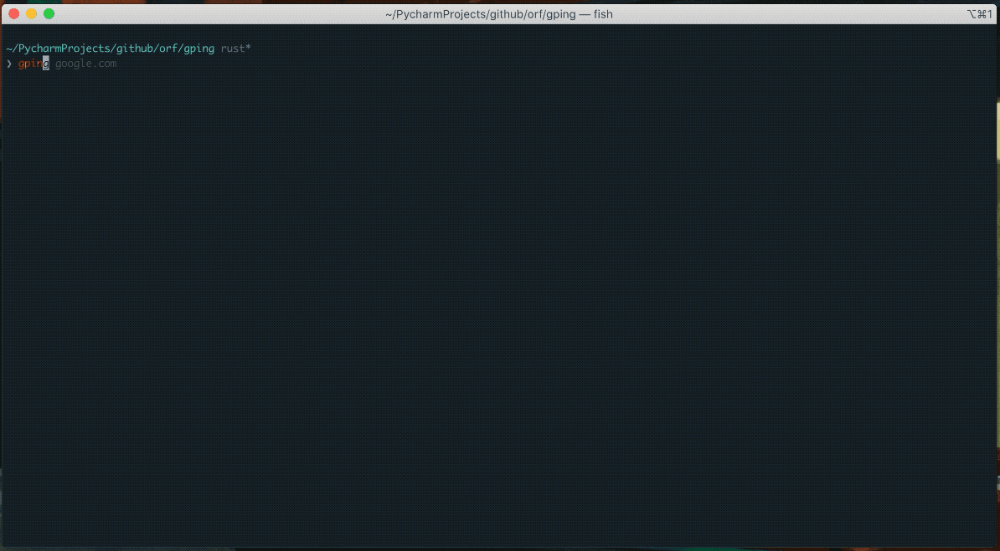

# gping 🚀

[](https://crates.io/crates/gping)
[](https://github.com/orf/gping/actions)

Ping, but with a graph.



Comes with the following super-powers:
* Graph the ping time for multiple hosts
* Graph the _execution time_ for commands via the `--cmd` flag
* Custom colours
* Windows, Mac and Linux support

Table of Contents
=================

   * [Install :cd:](#install-cd)
   * [Usage :saxophone:](#usage-saxophone)

<a href="https://repology.org/project/gping/versions">
    
</a>

# Install :cd:

* macOS
  * [Homebrew](https://formulae.brew.sh/formula/gping#default): `brew install gping`
  * [MacPorts](https://ports.macports.org/port/gping/): `sudo port install gping`
* Linux (Homebrew): `brew install gping`
* CentOS (and other distributions with an old glibc): Download the MUSL build from the latest release
* Windows/ARM:
  * Scoop: `scoop install gping`
  * Chocolatey: `choco install gping`
  * Download the latest release from [the github releases page](https://github.com/orf/gping/releases)
* Fedora ([COPR](https://copr.fedorainfracloud.org/coprs/atim/gping/)): `sudo dnf copr enable atim/gping -y && sudo dnf install gping`
* Cargo (**This requires `rustc` version 1.67.0 or greater**): `cargo install gping`
* Arch Linux: `pacman -S gping`
* Alpine linux: `apk add gping`
* Ubuntu >23.10/Debian >13: `apt install gping`
* Ubuntu/Debian ([Azlux's repo](https://packages.azlux.fr/)):
```bash
echo 'deb [signed-by=/usr/share/keyrings/azlux.gpg] https://packages.azlux.fr/debian/ bookworm main' | sudo tee /etc/apt/sources.list.d/azlux.list
sudo apt install gpg
curl -s https://azlux.fr/repo.gpg.key | gpg --dearmor | sudo tee /usr/share/keyrings/azlux.gpg > /dev/null
sudo apt update
sudo apt install gping
```
* Gentoo ([dm9pZCAq overlay](https://github.com/gentoo-mirror/dm9pZCAq)):
```sh
sudo eselect repository enable dm9pZCAq
sudo emerge --sync dm9pZCAq
sudo emerge net-misc/gping::dm9pZCAq
```
* FreeBSD:
  * [pkg](https://www.freshports.org/net-mgmt/gping/): `pkg install gping`
  * [ports](https://cgit.freebsd.org/ports/tree/net-mgmt/gping) `cd /usr/ports/net-mgmt/gping; make install clean`
* Docker:
```sh
# Check all options
docker run --rm -ti --network host ghcr.io/orf/gping:gping-v1.15.1 --help
# Ping google.com
docker run --rm -ti --network host ghcr.io/orf/gping:gping-v1.15.1 google.com
```
* Flox:
```sh
# Inside of a Flox environment
flox install gping
```

# Usage :saxophone:

Just run `gping [host]`. `host` can be a command like `curl google.com` if the `--cmd` flag is used. You can also use
shorthands like `aws:eu-west-1` or `aws:ca-central-1` to ping specific cloud regions. Only `aws` is currently supported.

```bash
$ gping --help
Ping, but with a graph.

Usage: gping [OPTIONS] [HOSTS_OR_COMMANDS]...

Arguments:
  [HOSTS_OR_COMMANDS]...  Hosts or IPs to ping, or commands to run if --cmd is provided. Can use cloud shorthands like aws:eu-west-1.

Options:
      --cmd
          Graph the execution time for a list of commands rather than pinging hosts
  -n, --watch-interval <WATCH_INTERVAL>
          Watch interval seconds (provide partial seconds like '0.5'). Default for ping is 0.2, default for cmd is 0.5.
  -b, --buffer <BUFFER>
          Determines the number of seconds to display in the graph. [default: 30]
  -4
          Resolve ping targets to IPv4 address
  -6
          Resolve ping targets to IPv6 address
  -i, --interface <INTERFACE>
          Interface to use when pinging
  -s, --simple-graphics
          Uses dot characters instead of braille
      --vertical-margin <VERTICAL_MARGIN>
          Vertical margin around the graph (top and bottom) [default: 1]
      --horizontal-margin <HORIZONTAL_MARGIN>
          Horizontal margin around the graph (left and right) [default: 0]
  -c, --color <color>
          Assign color to a graph entry. This option can be defined more than once as a comma separated string, and the order which the colors are provided will be matched against the hosts or commands passed to gping. Hexadecimal RGB color codes are accepted in the form of '#RRGGBB' or the following color names: 'black', 'red', 'green', 'yellow', 'blue', 'magenta','cyan', 'gray', 'dark-gray', 'light-red', 'light-green', 'light-yellow', 'light-blue', 'light-magenta', 'light-cyan', and 'white'
  -h, --help
          Print help information
  -V, --version
          Print version information
      --clear
          Clear the graph from the terminal after closing the program
```
